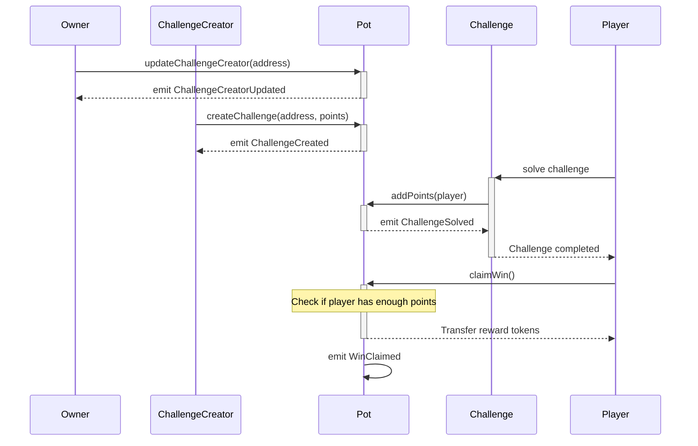

# 🚀 Sonic Summit Hackathon Vienna - 2025

This repository contains the code for all the dev track challenges.

## 📋 Deployments

| Contract | Address |
|----------|---------|
| Pot | `0x38dd721dFd51FdEe02e6641e0CE0d5872aDB90B1` |
| Might's Identity Crisis | `0x1237B533A88612E27aE447f7D84aa7Eb6722e39D` |
| Fang's Powerball Paradise | `0x786BeE5292B12AA79725cb66f0CBfb7E10A6CAc9` |
| Bad Gatekeeper | `0xF15dEe25CDeF6B00b878CC9f147De4F5D4cEC761` |
| Eu Tu, Proxy | `0xb73E7da3fA04A37bbE6be13CA4f1eC68b82a8A26` |
| Metal Knuckle's Permission | `0x6Dd509F963820F3950A56E3C0ABECdF8b3e92434` |
| Fang's Venom | `0x8919B92F52bb8C1aF7C9AFeE2Bdd179d3272919e` |
| Knuckle's Lending Pool | `0x68283749b8933E57fdBCA021fcCa03bcfB539199` |
| Vector's 3-Bit Surfer Island | `0x4328B9410575a383349F2e88644C933F91c6A5C6` |

## 🎮 How to Play

1. All challenges must be solved on-chain. So ensure you've some S tokens ready before starting. Every solve will be accounted for in the `Pot.sol` contract and the solves should be made as an on-chain transaction.
2. Once you've solved all challenges (reaching 200 points), submit your solution in cantina.
   - For submission to cantina, please use the [Submission template](./TEMPLATE_SUBMISSION.md).
   - Link for submission: https://cantina.xyz/competitions/ae21d78b-f752-4a9e-aad9-9d89f2b4b8b5
   - Ensure that you've reached the required points before submitting to Cantina.
3. After evaluation, your winning S tokens will be distributed.

## ⚙️ How It Works

### Challenge Lifecycle

## 🏆 Rewards

Solve all challenges to earn > 15,000 S tokens and demonstrate your hacking skills!

## 🔗 Links

- Documentation: [Click Here](https://jailbreak.soniclabs.com/docs)
- Hackathon Website: [Click Here](https://jailbreak.soniclabs.com/devs)
